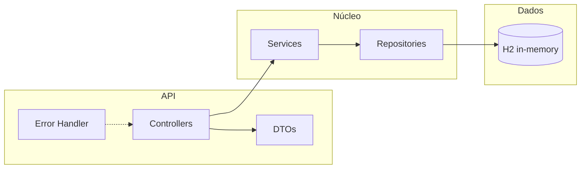

# Base para artigo acadêmico (formato institucional Unisales)

Este documento reúne: **verificação em relação ao enunciado do Produto 1**, **descrição do sistema**, **arquitetura e papel de cada pasta**, e **esqueleto das seções obrigatórias** do artigo (com campos a preencher após GitHub, SonarQube e OWASP ZAP).

---

## 1. Conformidade com o enunciado do trabalho

| Requisito do enunciado | Situação no repositório atual |
|------------------------|-------------------------------|
| Linguagem Java com Spring Boot | Atendido (`pom.xml`, Spring Boot 3.4.x, Java 21 no build) |
| Banco H2 ou SQLite | Atendido (H2 em memória, `application.yml`) |
| Arquitetura em camadas: controller, service, repository | Atendido (pacotes `api.controller`, `service`, `repository`) |
| `POST /usuarios` (cadastro) | Atendido (`UsuarioController`) |
| `POST /login` (autenticação) | Atendido (`AuthController`) |
| `GET/POST/PUT/DELETE /jogos` e `/jogos/{id}` | Atendido (`JogoController`) |
| `GET/POST /clientes` | Atendido (`ClienteController`) |
| `POST/GET /locacoes`, `PUT /locacoes/{id}/devolucao` | Atendido (`LocacaoController`) |
| Funcionalidades básicas de locadora | Atendido (usuários, jogos, clientes, locação e devolução) |
| **10 vulnerabilidades intencionais** (lista do tema) | **Não implementadas nesta base de código** — o projeto foi estruturado com validação, hash de senha, JPA parametrizado e tratamento de erro sem vazar stack trace. **O grupo deve implementar a versão “pedagógica” vulnerável** conforme orientação do professor (por exemplo em branch ou commit marcado), para depois analisar e corrigir na Demonstração de Competência. |
| Análise SAST (SonarQube) | **A executar** — preencher a Seção 6 deste documento com prints/exportação. |
| Análise DAST (OWASP ZAP) | **A executar** — preencher a Seção 7 deste documento com relatório. |
| Repositório no GitHub | **A publicar** — inserir o link na Seção 2 do artigo. |

**Resumo:** Os requisitos técnicos da API, stack e camadas estão alinhados ao enunciado. O item **vulnerabilidades intencionais** é exigência pedagógica separada: o código-fonte atual serve como **base funcional**; ajustem o repositório (ou uma variante) para cumprir a lista de 10 itens antes de rodar SAST/DAST sobre a versão “vulnerável”, se for o que o professor pedir.

---

## 2. Link do repositório GitHub

**[INSERIR AQUI O URL PÚBLICO DO REPOSITÓRIO]**

Exemplo de formato: `https://github.com/USUARIO_OU_ORG/locadora-videogames`

*Após criar o repositório no GitHub, faça `git init` (se ainda não houver), commit inicial, `remote add origin` e `push`.*

---

## 3. Descrição do sistema (para colar/adaptar no artigo)

O sistema é uma **API REST** para uma **locadora de video games**, desenvolvida em **Java** com **Spring Boot**. Permite:

- **Cadastro de usuários** e **autenticação** por e-mail e senha (resposta de login inclui identificador de sessão simulada para fins de demonstração).
- **Gestão de jogos** (listagem, inclusão, alteração e exclusão), com título, plataforma, preço diário e flag de ativo.
- **Cadastro e listagem de clientes**.
- **Registro de locações** vinculando cliente e jogo, com datas de locação e previsão de devolução, e **registro de devolução** por identificador da locação.

O armazenamento utiliza o banco **H2 em memória** em ambiente de desenvolvimento, com console web habilitado para inspeção. A aplicação expõe tratamento centralizado de erros e validação de entrada nos DTOs.

---

## 4. Arquitetura da aplicação

### 4.1 Visão em camadas (fluxo típico)

```text
Cliente HTTP  →  Controller (REST)  →  Service (regras de negócio)  →  Repository (JPA)  →  Banco H2
                     ↓
                  DTOs (entrada/saída)     Domain (entidades)
                     ↓
              ExceptionHandler (erros padronizados)
```

- **Controller:** recebe JSON, valida com Bean Validation, chama o service, devolve JSON.
- **Service:** orquestra regras (ex.: datas da locação, unicidade de e-mail, existência de entidades).
- **Repository:** persistência via Spring Data JPA (sem SQL manual concatenado na base atual).
- **Domain:** mapeamento objeto-relacional das tabelas.

### 4.2 Anotações por pasta (estrutura do código-fonte)

Raiz do projeto Maven:

| Pasta / arquivo | Função |
|-----------------|--------|
| `pom.xml` | Dependências (Spring Web, Validation, Data JPA, H2), versão do Java e plugin Spring Boot. |
| `src/main/resources/application.yml` | Porta do servidor, URL do datasource H2, JPA/Hibernate, habilitação do console H2. |
| `README.md` | Instruções de execução, endpoints e exemplos de uso. |
| `docs/` | Documentação de apoio (este arquivo para o artigo Unisales). |

Pacotes Java sob `src/main/java/br/com/unisales/locadora/`:

| Pasta | Função |
|-------|--------|
| *(raiz do pacote)* `LocadoraApplication.java` | Classe principal que inicia o Spring Boot. |
| `domain/` | **Entidades JPA** (`Usuario`, `Jogo`, `Cliente`, `Locacao`): tabelas, relacionamentos e campos persistidos. |
| `repository/` | **Interfaces Spring Data** que estendem `JpaRepository`: operações CRUD e consultas derivadas (ex.: usuário por e-mail). |
| `service/` | **Regras de negócio** e transações: cadastro com hash de senha, autenticação, CRUD de jogos/clientes, locação e devolução; exceções de domínio (`NotFoundException`, `BusinessException`); componente de hash (`PasswordHasher`). |
| `api/controller/` | **Camada REST:** mapeamento HTTP (`/usuarios`, `/login`, `/jogos`, `/clientes`, `/locacoes`). |
| `api/dto/` | **Objetos de transferência** (records): corpos de request/response e validações declarativas. |
| `api/error/` | **Tratamento global de exceções** e formato JSON de erro (`ApiError`, `GlobalExceptionHandler`). |

### 4.3 Diagrama simplificado (opcional no artigo)



---

## 5. Lista de vulnerabilidades implementadas (conforme enunciado)

Preencha esta tabela **com referência ao que o grupo de fato implementou** (arquivo, endpoint ou commit). A lista abaixo reproduz a exigência do trabalho.

| # | Vulnerabilidade (tema enunciado) | Onde está no código / como reproduzir | OWASP Top 10 (referência) |
|---|----------------------------------|----------------------------------------|---------------------------|
| 1 | Login vulnerável a SQL Injection | **[PREENCHER]** | A03 Injection |
| 2 | Cadastro sem validação de entrada (XSS) | **[PREENCHER]** | A03 Injection / contexto de XSS em front ou reflexão em API |
| 3 | Exposição de dados sensíveis (senha em texto plano) | **[PREENCHER]** | A02 Cryptographic Failures / A01 Broken Access Control |
| 4 | Falha de autenticação (sessão inadequada) | **[PREENCHER]** | A07 Identification and Authentication Failures |
| 5 | Controle de acesso inadequado (ex.: qualquer usuário deleta jogos) | **[PREENCHER]** | A01 Broken Access Control |
| 6 | Criação de jogos sem validação (command injection simulado) | **[PREENCHER]** | A03 Injection |
| 7 | Exposição de stack trace em erros | **[PREENCHER]** | A05 Security Misconfiguration |
| 8 | Falta de criptografia em dados sensíveis | **[PREENCHER]** | A02 Cryptographic Failures |
| 9 | Falha em validação de parâmetros (ID manipulável) | **[PREENCHER]** | A01 Broken Access Control |
|10 | Dependência vulnerável (biblioteca desatualizada) | **[PREENCHER]** | A06 Vulnerable and Outdated Components |

*Se o artigo exigir narrativa contínua, transforme cada linha em um parágrafo curto: cenário, causa, impacto e (na Demonstração de Competência) mitigação.*

---

## 6. Resultados do SonarQube (SAST)

**[INSERIR AQUI]**

Sugestão de conteúdo para o artigo:

- **Data da análise** e **versão/commit** analisados.
- **Métricas principais:** bugs, vulnerabilidades, code smells, cobertura (se houver), duplicação.
- **Print ou export:** Quality Gate (passou/falhou) e lista dos **issues** mais relevantes ligados à segurança.
- **Breve interpretação:** 2–3 frases sobre o que o SonarQube apontou em relação ao código da locadora.

---

## 7. Resultados do OWASP ZAP (DAST)

**[INSERIR AQUI]**

Sugestão de conteúdo para o artigo:

- **Versão do ZAP** e **URL base** testada (ex.: `http://localhost:8080`).
- **Tipo de scan** (baseline, full, etc.) e duração aproximada.
- **Resumo:** alertas por nível (High, Medium, Low, Informational).
- **Anexar** trecho do relatório HTML ou PDF com **2–3 alertas** comentados (nome, risco, URL afetada, evidência).

*Dica:* suba a API, execute um spider para descobrir rotas e depois o scan ativo; inclua no artigo se o alvo era a versão com ou sem vulnerabilidades intencionais.

---

## 8. Checklist final de entregáveis (enunciado)

- [ ] Repositório público no GitHub com o código-fonte.
- [ ] Artigo no padrão Unisales com **link do GitHub**.
- [ ] **Descrição do sistema** e **arquitetura** (pode reutilizar as Seções 3 e 4).
- [ ] **Lista das 10 vulnerabilidades** com indicação no código (quando implementadas).
- [ ] **Resultados SonarQube** (figuras ou tabela).
- [ ] **Resultados OWASP ZAP** (figuras ou trecho de relatório).

---

*Documento gerado como apoio ao trabalho acadêmico; ajuste títulos e numeração conforme o template oficial da Unisales (capa, resumo, referências ABNT, etc.).*
